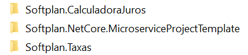
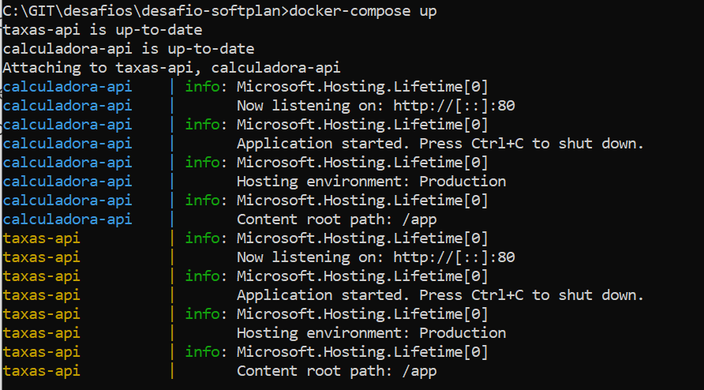

# Desafio Softplan

O desafio está escrito em .net core 3.1 com testes unitários e de integração utilizando xUnit.

Os projetos estão nos seguintes diretórios:

## API Template
Para facilitar a criação das APIs com a estrutura que eu desejava, padronizei criando um project template que se encontra no diretório **Softplan.NetCore.MicroserviceProjectTemplate**.

### Instalação e utilização
 1. Entrar no diretório da aplicação `cd Softplan.NetCore.MicroserviceProjectTemplate`
 2. Executar a instalação do template `dotnet new -i .\`
 
 Dessa forma o template já está disponível para utilização. É muito comum que esses templates fiquem hospedados como um artefato (ex: Nuget) para padronização de projetos pelo time.

Podemos assim criar uma API baseada no template com o comando: `dotnet new softplan-microservice -n Product`

## Executando o projeto
As imagens estão armazenadas no meu Docker Hub, para executar, podemos somente subir os contêineres com o docker-compose.

Para subir o projeto, execute na raiz do repositório (onde o arquivo docker-compose.yml está criado): `docker-compose up` 

O resultado será semelhante a imagem abaixo, o que mostra que os serviços estão executando:

As APIs estarão disponíveis para acesso e o endpoint do swagger estão nos endereços:

**API de taxas:** http://localhost:5000/swagger
**API de Cálculo** http://localhost:5001/swagger

